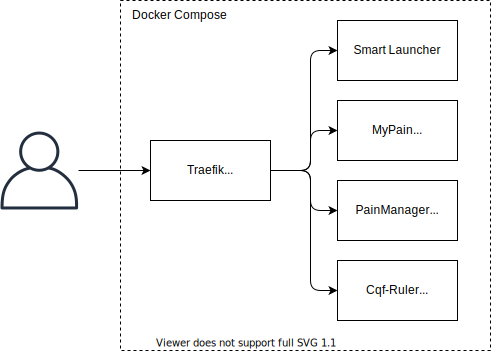
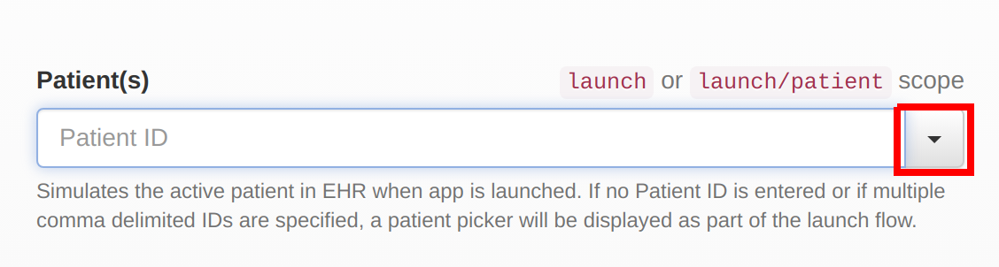
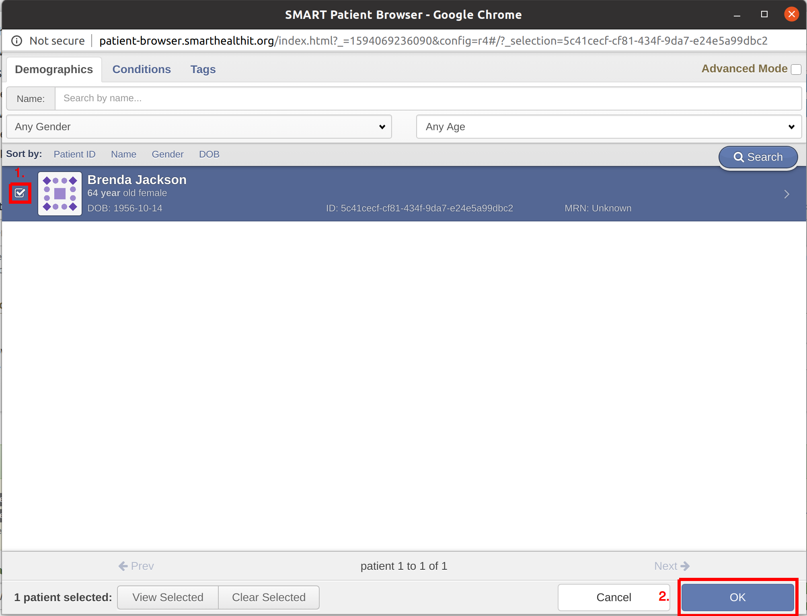
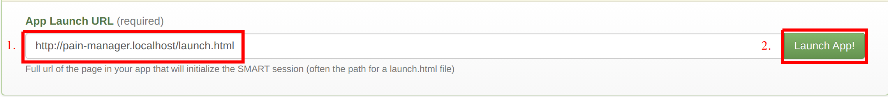

# CDS4CPM Sandbox

## Overview

The [Clinical Decision Support for Chronic Pain Management and Shared Decision-Making IG](https://github.com/cqframework/cds4cpm) (CDS4CPM) is a specification for services and operations that, taken together, allow patients and practitioners collaboratively make decisions about chronic pain management.

The repository contains documentation and scripts that allow a functioning sandbox demonstrating the overall solution to be stood up. There are several services involved:

* The [MyPain](https://github.com/cqframework/cds4cpm-mypain) application, which is a patient facing portal
* The [PainManager](https://github.com/cqframework/cds4cpm-mypain) application, which is a provider facing portal
* The [CQF-Ruler](https://github.com/DBCG/cqf-ruler), which functions as a FHIR database.
* The [Smart-Launcher](https://github.com/cqframework/smart-launcher) application, which simulates a launch from an EHR

Site-specific configuration for the solution may vary. This repository serves as a reference for where those configuration points are.

## Prerequisites

[Docker](https://docs.docker.com/get-docker/) version 19+

## Services

The sandbox uses docker-compose to set up several containers and link them all together to represent the complete system, as shown in the diagram below:



The [docker-compose.yml](docker/docker-compose.yml) file documents how each of those containers are configured to make the overall system work. Certain elements may not be required in each deployment. Specifically, the Smart Launcher will typically be replaced with an EHR's Smart Launch capability, the CQF-Ruler may be replaced with a site-specific FHIR server or facade, and the Traefik reverse proxy container would be replaced by a given site's networking solution.

The various services are available at:

[http://cloud.localhost/samplepath/smart-launcher](http://cloud.localhost/samplepath/smart-launcher)

[http://cloud.localhost/samplepath/my-pain](http://cloud.localhost/samplepath/my-pain)

[http://cloud.localhost/samplepath/pain-manager](http://cloud.localhost/samplepath/pain-manager)

[http://cloud.localhost/samplepath/r4/cqf-ruler](http://cloud.localhost/samplepath/r4/cqf-ruler)

The relevant configuration options that are used for each service are documented below.

## Usage

### Starting the Sandbox

This project uses a docker-compose file to do all of the above configuration for you automatically. The file is located [here](docker/docker-compose.yml) and demonstrates the usage of the various options.

From the /docker directory, run:

```bash
docker-compose -f docker-compose.yml -f docker-compose.local.yml --compatibility --env-file ./config/.env pull
docker-compose -f docker-compose.yml -f docker-compose.local.yml --compatibility --env-file ./config/.env up -d --remove-orphans
```

The appropriate docker containers will be downloaded and started. It may take a several minutes for all the containers to download and start.

***NOTE:*** On Windows Docker may ask to access your local hard-drive due to sample data and configuration being shared with the cqf-ruler from this repository. Please give Docker permissions to access the drive.

You can then browse the smart-launcher to select the correct applications and FHIR server by browsing

[http://cloud.localhost/samplepath/smart-launcher](http://cloud.localhost/samplepath/smart-launcher)

When you're done with the sandbox, the services can be stopped by pressing `Ctrl+C`. The services can then be deleted.

```bash
docker-compose down
```

Detailed information on the `docker-compose` command can be found on the [Docker website](https://docs.docker.com/compose/)

### Using the Sandbox

***NOTE:*** These steps require the use of the Chrome browser at the present time.

#### Selecting a Patient

Browse to [http://cloud.localhost/samplepath/smart-launcher](http://cloud.localhost/samplepath/smart-launcher)

Open the Patient Selector by clicking the arrow as shown in the following image



The Patient Selector will open. The Sandbox has been pre-populated with Brenda Jackson. Select a patient from the list and click "Ok" as shown in the following image



#### Launching MyPain or PainManager

Enter the launch url of MyPain or PainManager into the "Launch" box and click Launch as shown in the image below



The launch urls are as follows:

MyPain

`http://cloud.localhost/samplepath/my-pain/launch.html`

PainManager

`http://cloud.localhost/samplepath/my-pain/launch.html`

#### Adding Additional Data

The cqf-ruler implements a FHIR Rest API with support for creating, updating, and deleting resources. This endpoint is available at:

`http://cloud.localhost/samplepath/r4/cqf-ruler/fhir`

Instructions on how to load new Resources are available at the [Resource Loading](https://github.com/DBCG/cqf-ruler/wiki/Resource-Loading) page on the cqf-ruler wiki.

Additionally, a GUI interface is provided at:

[http://cloud.localhost/samplepath/r4/cqf-ruler](http://cloud.localhost/samplepath/r4/cqf-ruler)

### Using the applications

#### MyPAIN

MyPAIN may be launched from within the Smart Launcher or from a browser.  When using the browser a uri may be used:

[http://localhost:8000/launch.html?launch=eyJhIjoiMSIsImIiOiI1YzQxY2VjZi1jZjgxLTQzNGYtOWRhNy1lMjRlNWE5OWRiYzIiLCJlIjoiZWZiNWQ0Y2UtZGZmYy00N2RmLWFhNmQtMDVkMzcyZmRiNDA3IiwiZiI6IjEifQ==&iss=http://localhost:8080/cqf-ruler-r4/fhir](http://localhost:8000/launch.html?launch=eyJhIjoiMSIsImIiOiI1YzQxY2VjZi1jZjgxLTQzNGYtOWRhNy1lMjRlNWE5OWRiYzIiLCJlIjoiZWZiNWQ0Y2UtZGZmYy00N2RmLWFhNmQtMDVkMzcyZmRiNDA3IiwiZiI6IjEifQ==&iss=http://localhost:8080/cqf-ruler-r4/fhir)

The launch parameter is base64 encoded string including curly braces: {"a":"1","b":"5c41cecf-cf81-434f-9da7-e24e5a99dbc2","e":"efb5d4ce-dffc-47df-aa6d-05d372fdb407","f":"1"}
The 'b' variable is the patient id.  The "e" is the provider id.  On clicking the submit button the QuestionnaireResponse is stored on the fhir server provided at the end of the url.

#### QuestionnaireResponse/$extract operation

The extract operation takes a QuestionnaireResponse and returns a bundle of Observations from those responses.  An example QuestionniareResponse is  provided at:

[https://github.com/cqframework/cds4cpm-mypain/blob/develop/examples/exampleQuestionnaireResponse.json](https://github.com/cqframework/cds4cpm-mypain/blob/develop/examples/exampleQuestionnaireResponse.json)

Post the QuestionnaireResponse as the parameter named "questionnaireResponse" to the operation using a call such as 

```html
POST http://cloud.localhost/samplepath/r4/cqf-ruler/fhir/QuestionnaireResponse/$extract
```  

The resulting bundle of Observations will be posted to the questionnaireResponseExtract.endpoint set in the configuration file.

#### Observation/$transform operation

The transform operation takes a Parameters resource containing a BUndle of Observations and a ConceptMap url.  Examples of these can be found at:

[https://github.com/cqframework/cds4cpm-mypain/blob/develop/examples/exampleObservationBundle.json](https://github.com/cqframework/cds4cpm-mypain/blob/develop/examples/exampleObservationBundle.json)

[https://github.com/cqframework/cds4cpm-mypain/blob/develop/examples/exampleConceptMap.json](https://github.com/cqframework/cds4cpm-mypain/blob/develop/examples/exampleConceptMap.json)

Post the Parameters to the operation:

```html
POST http://cloud.localhost/samplepath/r4/cqf-ruler/fhir/QuestionnaireResponse/$transform
```  

A Bundle of Observations is returned with site codes replacing the original codes for the values of the Observations or if "observationTransform.replaceCode=false" then the site codes will be added as a new Observation value code with the concept map's corresponding display value.

## Configuration

### CQF-Ruler

The primary source for documentation of the deployment of CQF-Ruler
 is located at the CQF-Ruler wiki on the [Deployment](https://github.com/DBCG/cqf-ruler/wiki/Deployment) page.

For usage in the CDS4CPM sandbox several specific options need to be enabled:

1. OAuth Redirection to an authorization server
2. Questionnaire Response extraction
3. Server base address

All of these are enabled by setting properties in a configuration file. This configuration file is then mounted into the Docker container where the CQF-Ruler can read and load it.

#### OAuth Redirection

Adding the following lines to the configuration file enables OAuth Redirection

```yaml
##################################################
# OAuth Settings
##################################################
oauth.enabled=true
oauth.securityCors=true
oauth.securityUrl=http://fhir-registry.smarthealthit.org/StructureDefinition/oauth-uris
oauth.securityExtAuthUrl=authorize
oauth.securityExtAuthValueUri=http://launch.smarthealthit.org/v/r4/auth/authorize
oauth.securityExtTokenUrl=token
oauth.securityExtTokenValueUri=http://launch.smarthealthit.org/v/r4/auth/token
oauth.serviceSystem=http://hl7.org/fhir/restful-security-service
oauth.serviceCode=SMART-on-FHIR
oauth.serviceDisplay=SMART-on-FHIR
oauth.serviceText=OAuth2 using SMART-on-FHIR profile (see http:?/docs.smarthealthit.org)
```

The links in the sample above use the SMART-on-FHIR launch application available at [http://launch.smarthealthit.org](http://launch.smarthealthit.org).

In particular, the `oauth.securityUrl`, `oauth.securityExtAuthValueUri`, and `oauth.securityExtTokenValueUri` values will need to be set appropriately for your environment.

#### QuestionnaireResponse Extraction

Adding the following lines to the configuration file enables QuestionnaireResponse extraction.

```yaml
##################################################
# QuestionnaireResponse Extraction Settings
##################################################
questionnaireResponseExtract.enabled=true
questionnaireResponseExtract.endpoint=https://cds4cpm-develop.sandbox.alphora.com/cqf-ruler-r4/fhir
questionnaireResponseExtract.username=
questionnaireResponseExtract.password=
```

The `questionnaireResponseExtract.endpoint` is where the extracted Observation will be PUT. `questionnaireResponseExtract.username` and `questionnaireResponseExtract.password` are used to configure credentials for that endpoint.

#### Observation code transformation

Adding the following lines to the configuration file enables an Observation bundle to have it's codes transformed from one code system to another using a ConceptMap.

```yaml
##################################################
# Observation Transformation Settings
##################################################
observationTransform.enabled=true
observationTransform.username=
observationTransform.password=
observationTransform.replaceCode=false
```

The `observationTransform.enabled` turns on and off the operation.  The `observationTransform.replaceCode=false` does not replace the code in the Observation, but adds a new code to the Observation.

#### Server Address

These properties are inherited from the HAPI FHIR server.

```yaml
##################################################
# Server Address
##################################################
server_address=http://cqf-ruler.localhost/cqf-ruler-dstu3/fhir/
server.base=/cqf-ruler-dstu3/fhir
```

Working examples of the configurations files for the cqf-ruler are located in the [docker/config/cqf-ruler](docker/config/cqf-ruler) folder.

#### Mounting Configuration Files

Docker supports mounting external files into a container. The syntax for this is:

```bash
docker run --v /source:/target fooContainer
```

The directory located on the host at /source will be available in the container at /target.

Docker also supports setting environment variables for a container. The syntax for that is:

```bash
docker run -e ENV_VARIABLE=value fooContainer
```


### Smart Launcher

#### FHIR Servers

The FHIR servers available are set with environment variables:

```yaml
environment:
  - "FHIR_SERVER_R4=http://cqf-ruler.localhost/cqf-ruler-r4/fhir"
  - "FHIR_SERVER_R3=http://cqf-ruler.localhost/cqf-ruler-dstu3/fhir"
```

The base urls expected for the launcher are set with .env file and passed in to the compose file to set the path, 'samplepath' is used as a temporary placeholder:

```yaml
  environment:
   - HAPI_FHIR_SERVER_ADDRESS=${PROTOCOL}://${HOST}${DOMAIN}/samplepath/r4/cqf-ruler/fhir
```

This configuration is demonstrated in the in the [docker-compose.yml](docker/docker-compose.yml) file.

## Development

This section is intended for developers working on the cds4cpm sandbox

### Updating Sample Data

The sample data is stored in small H2 databases located at [docker/config/cqf-ruler/h2](docker/config/cqf-ruler/h2). These databases are shared with the cqf-ruler on startup, and are mapped bi-directionally with the host machine. If you need to update the sandbox data, do the following:

1. Start the sandbox with `docker-compose`
2. Post the required data to the cqf-ruler as described in [Adding Additional Data](#adding-additional-data).
3. Stop the sandbox
4. Commit the resulting changes to the database files to the repo.

### Resetting the Sandbox Data

If you want to get back to the state of the sample data as of the latest commit use:

`git restore docker/config/cqf-ruler/h2/*`

## License

Apache 2.0
